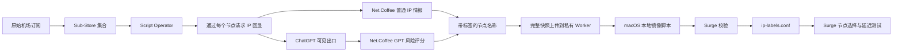

# Surge IP Labeler：项目总结、使用手册与重部署指南

> 版本基线：`main` / `5bcef8c`（2026-07-16）  
> 支持范围：Surge **macOS**。iOS 方案已撤销，不在当前产品范围内。

## 一句话说明

这是一个给 Surge 节点“贴出口 IP 身份标签”的工具。它不会更换机场订阅，也不会改变节点怎么连接；它只在节点名称后追加真实出口 IP、评分、住宅/机房、原生性、人机流量和 GPT 风险评分，帮助用户在 Surge 的节点选择列表中做判断。

例如：

```text
IPLC 香港 02 [118.140.56.81] | 🟢100 | 原生IP | 住宅 | 人类偏多 | GPT评分:68
```

## 1. 项目解决了什么问题

普通节点名通常只有地区或机场编号，例如“IPLC 香港 02”。实际使用时，用户无法从名称判断：

- 该节点真实从哪个公网 IP 出口；
- IP 的信任评分和风险；
- 是否可能是住宅、机房、广播或历史滥用 IP；
- 流量更像真实用户还是机器；
- ChatGPT 看到该节点时的实际出口及其风险评分。

本项目将这些可获得的信息压缩进节点名称，因此用户在 Surge 的延迟测试/节点选择窗口中无需另外打开查询网站。

## 2. 已实现功能

| 功能 | 当前实现 |
| --- | --- |
| 保留原订阅 | 原订阅和 Sub-Store 集合保持不变；只在导出后的节点对象上改名称。 |
| 真实出口 IP | 通过指定节点发起 IP 回显请求，而非依据节点域名推测。 |
| 普通 IP 评分 | 使用 Net.Coffee `trust_score`，按 80/50 阈值显示绿/黄/红圆点。 |
| 原生性与地域 | 支持原生、非原生、广播 IP 等；没有可信结果时不显示。 |
| 住宅/机房识别 | 显示住宅、机房 IP 或非住宅；不会把未知写成确定结论。 |
| 风险/人机信号 | 可显示历史滥用、机器偏多或人类偏多。 |
| GPT 风险评分 | 使用 ChatGPT 实际可见出口的 Net.Coffee `iprisk.trust_score`，不是普通 IP 的误用字段。 |
| 缓存 | 普通 IP 情报与 GPT 出口风险均缓存 24 小时，减少重复查询。 |
| 快照保存 | 扫描整轮完成后才上传完整快照，不上传半成品。 |
| 私有读取 | Worker 上传端与读取端分别由 `SYNC_TOKEN`、`READ_TOKEN` 保护。 |
| 本地安全镜像 | 先校验，再原子写入；失败时保留旧的 Surge 节点文件。 |
| 自动更新 | Sub-Store 约每 12 小时扫描；macOS 在稍后自动写入本地节点列表。 |
| 发布保护 | GitHub Pages 发布前运行 `npm test`，公开站点不应包含节点凭据或令牌。 |

## 3. 非技术说明：它是怎样工作的



用日常语言解释：

1. Sub-Store 仍然负责把多个机场订阅合并；
2. 标签脚本让每个节点访问一个“告诉我我是谁”的服务，因此得到的是该节点真正的出口 IP；
3. 脚本向 IP 情报服务查询，再把结果写到节点名称后；
4. 扫描整轮成功后，把这一份“带标签的节点清单”存到私有 Worker；
5. Mac 定时下载这份清单，先让 Surge 检查格式；
6. 检查成功才替换本地清单，Surge 随后显示新标签。

原始订阅从头到尾没有被改写；本地标签文件只是可随时删除和重建的衍生品。

## 4. 数据与标签的含义

### 常见显示

```text
节点名 [完整出口IP] | 普通评分 | 原生性 | 网络类型 | 风险/人机 | GPT评分
```

| 片段 | 含义 |
| --- | --- |
| `[118.140.56.81]` | 该节点请求 IP 回显服务时实际使用的出口 IP。 |
| `🟢100`、`🟡67`、`🔴31` | Net.Coffee 普通 IP 信任评分；绿为 80–100，黄为 50–79，红为 0–49。 |
| `原生IP` / `广播IP (US)` | 情报服务提供或可安全推导的原生性/注册地域信号。 |
| `住宅` / `机房IP` / `非住宅` | 网络属性。机房不代表一定不可用，只表示常见的托管网络特征。 |
| `历史滥用` | 情报源有滥用风险信号。 |
| `人类偏多` / `机器偏多` | 情报源的人机流量倾向，不是精确百分比。 |
| `GPT评分:68` | ChatGPT 实际看到的出口 IP 的风险评分；它可能与普通出口 IP 评分不同。 |

### 降级原则

- 不能拿到分类数据时，隐藏该分类；不显示“原生未知、住宅未知、人类未知”；
- 出口请求失败时保留节点，名称显示 `[出口请求失败] | 评分未知`，方便识别故障而不丢节点；
- GPT 检测失败时只隐藏 GPT 分数，不用猜测；
- 普通评分未知时显示 `评分未知`，不显示颜色圆点。

## 5. 日常使用说明（当前用户环境）

### 5.1 正常使用

1. 在 Surge 中使用 `🔄 手动切换` 或 `🧪 IP 标签本地测试`；
2. 打开节点列表或执行延迟测试；
3. 根据名称中的完整 IP、评分和标签选择节点；
4. 不要手动编辑 `ip-labels.conf`，它是自动生成文件。

### 5.2 更新节奏

| 时间 | 动作 |
| --- | --- |
| 11:55 | Sub-Store 同步并执行集合操作。 |
| 12:20 | Mac 下载并校验最新完整快照，再刷新本地资源。 |
| 23:55 | Sub-Store 模块原有的每日同步。 |
| 次日 00:20 | Mac 再次写入并刷新本地资源。 |

因此正常情况下，扫描结束后大约 25 分钟，标签会进入 Surge 的本地节点列表。若希望立即更新，可在 Sub-Store 做“即时预览/保存”，然后手动运行镜像脚本。

### 5.3 手动刷新

```bash
"/Users/jeffereyreng/Library/Application Support/Surge/Scripts/sync-ip-labels.sh"
```

成功输出只会给出更新的节点数量。随后在 Surge 的外部资源窗口确认 `ip-labels.conf` 为“就绪”。

### 5.4 更换机场服务商

- **仍在同一 Sub-Store 集合中：** 保留 Script Operator。下一次扫描会发现新节点；旧快照会一直存在到新快照完整上传。
- **新建了 Sub-Store 集合：** 在新集合重新添加同一份 Script Operator 和同步参数；原始机场订阅不需要改造成别的链接。
- **想马上看到结果：** 对新集合执行一次即时预览并保存，待完整快照上传后手动运行本地镜像。

## 6. 从零部署教程

本节用于未来需要重新搭建时使用。所有示例令牌均为占位符，绝不能写进仓库或聊天。

### 6.1 前置条件

- macOS、Surge 与可用的 `surge-cli`；
- 已安装并运行 Sub-Store Surge-ability 模块；
- Node.js 22（Pages 工作流使用该版本）；
- Cloudflare 账号、Workers、KV 与自有域名（可选但推荐）；
- GitHub 仓库的 Pages 权限；
- 已安装并登录 Wrangler、GitHub CLI（可选）。

### 6.2 获取并验证代码

```bash
git clone https://github.com/JiahangRen/surge-ip-labeler.git
cd surge-ip-labeler
npm test
```

只有全部测试通过再部署。GitHub Pages 工作流监听 `main`；不要只推送特性分支或 `master`。

### 6.3 部署 Cloudflare Worker

1. 创建 KV 命名空间：

   ```bash
   cd worker
   wrangler kv namespace create surge-ip-labeler-policies
   ```

2. 将返回的 namespace ID 填入 `worker/wrangler.toml` 的 `[[kv_namespaces]] id`；不要保留占位符。
3. 配置 Worker 密钥：

   ```bash
   wrangler secret put SYNC_TOKEN
   wrangler secret put READ_TOKEN
   ```

   `SYNC_TOKEN` 用于 Sub-Store 上传；`READ_TOKEN` 仅放在 Mac Keychain。二者必须不同、足够随机。

4. 如要使用自有域名，在 `worker/wrangler.toml` 配置路由，例如：

   ```toml
   [[routes]]
   pattern = "ip-labeler.example.com"
   custom_domain = true
   ```

5. 部署：

   ```bash
   wrangler deploy
   ```

6. 无敏感健康检查：

   ```bash
   curl --noproxy '*' --silent --show-error https://ip-labeler.example.com/v1/status
   ```

   初次没有快照时应返回 `updatedAt: null`、节点数为 0。这不是错误。

### 6.4 发布 GitHub Pages

```bash
git checkout main
git push origin main
```

Pages 工作流会先跑测试，再发布 `site/` 目录。检查 GitHub Actions 的 **Deploy GitHub Pages** 工作流成功后，公开脚本可通过：

```text
https://<GitHub用户名>.github.io/surge-ip-labeler/substore-ip-labeler.js
```

### 6.5 配置 Sub-Store

在目标集合的“节点操作”中添加 Script Operator，远程脚本链接的模板：

```text
https://<GitHub用户名>.github.io/surge-ip-labeler/substore-ip-labeler.js#limit=5&sync_url=https%3A%2F%2Fip-labeler.example.com%2Fv1%2Fsnapshot&sync_token=YOUR_SYNC_TOKEN
```

说明：

- `limit=5` 为默认并发；节点很多可适当调整，但不要超出 10；
- `sync_url` 和 `sync_token` 必须同时存在；
- `sync_token` 仅填写在 Sub-Store 本地配置中；
- 先用即时预览检查标签和节点数量，再保存。

### 6.6 配置 Mac 本地镜像

1. 将读取令牌保存到 Keychain：

   ```bash
   security add-generic-password -U -a "$USER" -s surge-ip-labeler-read-token -w
   ```

2. 首次生成本地文件：

   ```bash
   node "$(pwd)/scripts/sync-local-policy-file.mjs" \
     --output "$HOME/Library/Application Support/Surge/Profiles/ip-labels.conf"
   ```

3. 在 Surge `[Proxy Group]` 先增加一个**不被规则引用**的测试组：

   ```ini
   🧪 IP 标签本地测试 = select, policy-path=ip-labels.conf
   ```

4. 应用后确认测试组中显示标签且可测延迟；确认无误后，再按需把正式手动选择组改为本地 `policy-path=ip-labels.conf`。

5. 最后才创建 LaunchAgent：它应在每次 Sub-Store 扫描后约 20–30 分钟运行镜像脚本，并只刷新该本地外部资源。

### 6.7 推荐 LaunchAgent 模板

将以下内容保存为 `~/Library/Application Support/Surge/Scripts/sync-ip-labels.sh` 后赋予执行权限。路径应使用**稳定的主仓库路径**，不要依赖可被删除的 worktree。

```sh
#!/bin/zsh
set -eu

/opt/homebrew/bin/node \
  "/Users/你的用户名/Documents/surge模块/scripts/sync-local-policy-file.mjs" \
  --output "/Users/你的用户名/Library/Application Support/Surge/Profiles/ip-labels.conf" \
  --keychain-account "你的用户名"

/opt/homebrew/bin/surge-cli external-resource update "本地资源键"
```

随后用 LaunchAgent 在每日 00:20 与 12:20 调用它。创建前先确认：

```bash
/opt/homebrew/bin/surge-cli --check \
  "/Users/你的用户名/Library/Application Support/Surge/Profiles/你的配置.conf"
```

## 7. 项目结构

```text
surge-ip-labeler/
├── site/                         # GitHub Pages 公共文件（不含秘密）
│   ├── substore-ip-labeler.js    # Sub-Store 实际加载的自包含脚本
│   ├── module.sgmodule           # 历史 Surge 模块入口；当前不推荐主路径使用
│   └── index.html                # 简单说明页
├── src/
│   ├── substore/ip-labeler.js    # 可测试的 Sub-Store 扫描核心
│   ├── shared/policy.js          # 名称解析、清洗与标签格式化
│   ├── local/                    # 下载、Keychain、校验、原子写入
│   └── surge/                    # 旧 Surge 直接扫描实现
├── worker/
│   ├── src/index.js              # Cloudflare Worker 三个端点
│   └── wrangler.toml             # KV 和域名配置（无 secret）
├── scripts/
│   └── sync-local-policy-file.mjs # Mac 本地镜像 CLI
├── test/                         # Node 内置测试
├── docs/superpowers/             # 历史设计与实施计划
├── handoff.md                    # 新会话交接信息
└── PROJECT_SUMMARY.md            # 本文件
```

## 8. 排障手册

### “所有节点都是评分未知/出口请求失败”

先在 Sub-Store 的即时预览检查。若预览也失败，通常是节点本身、Surge-ability 或出口请求不可用；若预览正确而 Surge 不更新，优先检查本地镜像日志和 `ip-labels.conf` 外部资源状态。

### “Sub-Store 预览正确，但 Surge 节点列表没变”

这是最常见的“快照已生成但本地镜像未刷新”情形：

1. 查看 Worker `/v1/status` 是否有新的 `updatedAt`；
2. 手动运行 `sync-ip-labels.sh`；
3. 确认 `surge-cli` 可执行、Keychain 中有 `READ_TOKEN`、本地资源键未变；
4. 确认 `🔄 手动切换` 使用的是 `policy-path=ip-labels.conf`，而不是旧远程 URL。

### “外部资源超时、404 或无法解析”

不要把 `sub.store/download/...` 或 Worker 私有 URL 直接当正式 `policy-path`。当前网络环境中该路线曾导致超时、404 或格式解析失败。回到已验证的本地 `ip-labels.conf` 路线。

### “GPT 评分看起来不对”

确认使用的是当前 `site/substore-ip-labeler.js`。正确算法必须先通过节点访问 `chatgpt.com/cdn-cgi/trace`，再将返回的 ChatGPT 可见出口查入 `iprisk`。普通出口 IP 的评分与 GPT 评分不同是正常的。

### “换订阅后旧节点还在”

本地文件会保留上一份完整有效快照，直到新集合完成整轮扫描并上传。立即执行 Sub-Store 即时预览/保存，然后运行本地镜像即可缩短等待时间。

## 9. 安全与隐私规则

- `SYNC_TOKEN`、`READ_TOKEN`、订阅 URL、节点密码、UUID、完整代理行都属于敏感信息；
- Worker 的订阅读取接口使用 `Cache-Control: private, no-store`；
- 公开 GitHub Pages 只放脚本和文档，不放节点清单；
- 处理异常时不要打印完整请求 URL；其中可能含读取令牌；
- 未验证的新配置只能先放进独立测试组；
- 若令牌误泄露，立刻在 Worker 轮换对应 secret，并更新 Sub-Store 或 Keychain，不需要改机场订阅。

## 10. 系统复盘：可复用经验

1. **先验证数据路径，再优化显示。** 节点名称是否正确取决于“请求真的经过该节点”，不能用节点域名或地区名称代替出口 IP。
2. **将扫描和消费分离。** 扫描很慢且易受节点网络影响；Surge 节点选择应只读取已完成快照，不能现场扫描。
3. **本地原子镜像比远程 `policy-path` 更适合不稳定网络。** 它能先校验并保留上一个可用版本，避免订阅更新失败影响网络。
4. **关键指标必须追溯到正确的观察点。** GPT 分数应对应 ChatGPT 看见的出口；“看起来像分数”的其他字段不能替代它。
5. **未知比伪造更有价值。** 隐藏缺失类别、显式标注扫描失败，比编造“未知类别”或百分比更利于判断。
6. **发布路径要与分支策略匹配。** Pages 监听 `main`，只推送特性分支会让公开 URL 保持旧版本或 404。
7. **自动化脚本不要依赖临时开发目录。** worktree 可以用于开发，但生产 LaunchAgent 应引用稳定仓库路径。
8. **功能试验必须可独立回退。** iOS 试验曾以独立模块和端点实现，最终可完整撤销且不影响 Mac；这证明隔离试验组优于直接替换主策略组。

## 11. 已撤销范围

项目曾短暂实现 iOS 专用 Worker 端点与模块。因用户决定放弃 iOS 支持，当前已撤销：

- `site/ios-ip-labeler.sgmodule` 已删除；
- `/v1/ios-policy` 已删除并验证返回 404；
- `IOS_READ_TOKEN` 已从 Worker 删除；
- iOS 设计、计划、文档和测试已删除；
- macOS 生产路径未被更改。

后续若重新提出 iOS 支持，必须重新设计、重新做安全评审和独立测试，不能直接恢复旧提交。
